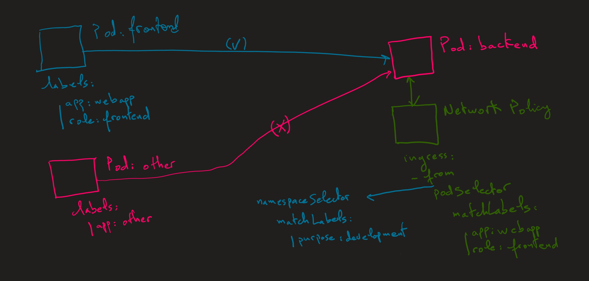

# Kubernetes NetworkPolicy using Calico

All pods within a Kubernetes cluster can communicate with each other, by default.
This is still true even if they are from different namespaces.
Namespaces are not a network boundary. It is just logical resource to group objects of the same application together.

This is a security concern.

Many applications and application teams could share the same kubernetes cluster.
A security requirement is to limit the inter-pod traffic. That is part of the `Zero Trust Network` principle.
To achieve that, Kubernetes uses `Network Policy`.

>Network policy allows you to define policies allowing or denying traffic between specific pods or namespaces.
It is a kind of `Firewall` inside the cluster.

This workshop will walk you through how to create network policies in Kubernetes using Calico.

  

Check the `commands.sh` file to get all the commands used in this workshop.  

## Requirements: AKS with Calico enabled

We'll need a Kubernetes cluster (or Minikube) with Calico enabled.

```sh
az group create -n rg-aks -l westeurope
az aks create -n aks-cluster -g rg-aks --network-policy calico
az aks get-credentials -g rg-aks -n aks-cluster
```

## 1. Deny inbound traffic from all Pods

### 1.1. Create development namespace with labels


```sh
kubectl create -f 1-namespace-development.yaml  
#or  
kubectl create namespace development  
kubectl label namespace/development purpose=development  
```

### 1.2. Create an nginx Pod and Service


```sh
kubectl run backend --image=nginx --labels app=webapp,role=backend --namespace development --expose --port 80 --generator=run-pod/v1  
or  
kubectl create -f 1-pod-svc-nginx-backend.yaml  
```

### 1.3. Create Alpine Pod for testing access to other pods


```sh
kubectl run --rm -it --image=alpine frontend --namespace development --generator=run-pod/v1  
wget -qO- http://backend  
or  
kubectl create -f 1-pod-alpine-test.yaml  
kubectl exec alpine -n development -- wget -qO- http://backend  
```

You should be able to view default nginx home page (welcome to Nginx!).
That indicates the connection was successful.

### 1.4. Create a Network Policy to deny all connections to backend Pod

```yaml
# 1-network-policy-deny-all.yaml
kind: NetworkPolicy
apiVersion: networking.k8s.io/v1
metadata:
  name: backend-policy
  namespace: development
spec:
  podSelector:
    matchLabels:
      app: webapp
      role: backend
  ingress: []
```

```sh
kubectl apply -f 1-network-policy-deny-all.yaml  
```

### 1.5. Test access to backend Pod


We'll reuse the same Alpine image to run the test:

```sh
kubectl run --rm -it --image=alpine frontend --namespace development --generator=run-pod/v1  
wget -qO- --timeout=2 http://backend  
or  
kubectl exec alpine -n development -- wget -qO- --timeout=2 http://backend  
```

## 2. Allow inbound traffic based on pod labels

### 2.1. Update the previous Network Policy to allow traffic from only pods with specific labels

```yaml
# 2-network-policy-allow-pod.yaml
kind: NetworkPolicy
apiVersion: networking.k8s.io/v1
metadata:
  name: backend-policy
  namespace: development
spec:
  podSelector:
    matchLabels:
      app: webapp
      role: backend
  ingress:
  - from:
    - namespaceSelector: {}
      podSelector:
        matchLabels:
          app: webapp
          role: frontend
```

```sh
kubectl apply -f 2-network-policy-allow-pod.yaml
```

### 2.2. Test pod with matching labels


```sh
kubectl run --rm -it frontend --image=alpine --labels app=webapp,role=frontend --namespace development --generator=run-pod/v1  
wget -qO- http://backend  
```

### 2.3. Test pod without matching labels


```sh
kubectl run --rm -it --image=alpine frontend --namespace development --generator=run-pod/v1  
wget -qO- --timeout=2 http://backend  
```

## 3. Allow traffic only from pods with matching labels and within specific namespace

### 3.1. Test without policy and pod reaching other namespaces


```sh
kubectl create namespace production  
kubectl label namespace/production purpose=production  
kubectl run --rm -it frontend --image=alpine --labels app=webapp,role=frontend --namespace production --generator=run-pod/v1  
wget -qO- http://backend.development  
```

### 3.2. Create the policy

```yaml
# 3-network-policy-allow-pod-namespace.yaml
kind: NetworkPolicy
apiVersion: networking.k8s.io/v1
metadata:
  name: backend-policy
  namespace: development
spec:
  podSelector:
    matchLabels:
      app: webapp
      role: backend
  ingress:
  - from:
    - namespaceSelector:
        matchLabels:
          purpose: development
      podSelector:
        matchLabels:
          app: webapp
          role: frontend
```

```sh
kubectl apply -f 3-network-policy-allow-pod-namespace.yaml  
```

### 3.3. Test with policy and pod with matching labels and not within specific namespace


```sh
kubectl run --rm -it frontend --image=alpine --labels app=webapp,role=frontend --namespace production --generator=run-pod/v1  
wget -qO- --timeout=2 http://backend.development  
```

### 3.4. Test with policy and pod with matching labels and within specific namespace


```sh
kubectl run --rm -it frontend --image=alpine --labels app=webapp,role=frontend --namespace development --generator=run-pod/v1  
wget -qO- http://backend  
```