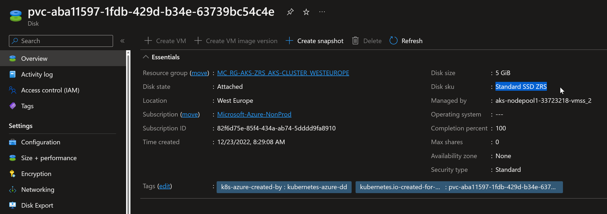

# Using Azure ZRS Disk in AKS

## Introduction

This lab will show how to use an Azure DISK with ZRS feature and how it can be used in multiple availability zones.


## Lab steps
0. Setup demo environment
1. Deploy a sample deployment with PVC (Azure Disk with ZRS)
2. Simulate zone failure (delete or drain nodes in AZ)
3. Verify the pod will be rescheduled in another zone
4. Verify the data inside the Disk

## 0. Setup demo environment

```powershell
# Variables
$AKS_RG="rg-aks-zrs"
$AKS_NAME="aks-cluster"

# Create and connect to AKS cluster
az group create --name $AKS_RG --location westeurope

az aks create --name $AKS_NAME --resource-group $AKS_RG --node-count 3 --zones 1 2 3 

az aks get-credentials -n $AKS_NAME -g $AKS_RG --overwrite-existing

kubectl get nodes
# NAME                                STATUS   ROLES   AGE   VERSION
# aks-nodepool1-33723218-vmss000000   Ready    agent   70m   v1.23.12
# aks-nodepool1-33723218-vmss000001   Ready    agent   71m   v1.23.12
# aks-nodepool1-33723218-vmss000002   Ready    agent   71m   v1.23.12
```

## 1. Deploy a sample deployment with PVC (Azure Disk with zrs)

```powershell
kubectl apply -f zrs-disk-deploy.yaml -f .\zrs-disk-pvc-sc.yaml
# deployment.apps/nginx-zrs created
# storageclass.storage.k8s.io/managed-csi-zrs created
# persistentvolumeclaim/azure-managed-disk-zrs created
```

Verify resources deployed successfully

```powershell
# kubectl get pods,pv,pvc
# NAME                             READY   STATUS              RESTARTS   AGE
# pod/nginx-zrs-84c66f9654-mkn9d   0/1     ContainerCreating   0          10s

# NAME                                                        CAPACITY   ACCESS MODES   RECLAIM POLICY   STATUS   CLAIM                            STORAGECLASS      REASON   AGE
# persistentvolume/pvc-38370de3-4dc7-49d8-9752-4565c0dab8a7   5Gi        RWO            Delete           Bound    default/azure-managed-disk-zrs   managed-csi-zrs            5s

# NAME                                           STATUS   VOLUME                                     CAPACITY   ACCESS MODES   STORAGECLASS      AGE
# persistentvolumeclaim/azure-managed-disk-zrs   Bound    pvc-38370de3-4dc7-49d8-9752-4565c0dab8a7   5Gi        RWO            managed-csi-zrs   9s
```

View the disk on the Azure portal.


Verify data persisted in the disk

```powershell
$POD_NAME=$(kubectl get pods -l app=nginx-zrs -o jsonpath='{.items[0].metadata.name}')
echo $POD_NAME
# nginx-zrs-84c66f9654-mkn9d

kubectl exec $POD_NAME -it -- cat /mnt/azuredisk/outfile
# Fri Dec 23 08:27:30 UTC 2022
```

Check the worker node for the pod

```powershell
kubectl get pods -o wide
# NAME                         READY   STATUS    RESTARTS   AGE    IP           NODE
# nginx-zrs-84c66f9654-mkn9d   1/1     Running   0          2m2s   10.244.2.4   aks-nodepool1-33723218-vmss000000

kubectl get nodes
# NAME                                STATUS   ROLES   AGE   VERSION
# aks-nodepool1-33723218-vmss000000   Ready    agent   83m   v1.23.12
# aks-nodepool1-33723218-vmss000001   Ready    agent   83m   v1.23.12
# aks-nodepool1-33723218-vmss000002   Ready    agent   83m   v1.23.12
```

Worker Nodes are deployed into the 3 Azure Availability Zones

```powershell
Set-Alias -Name grep -Value select-string # if using powershell

kubectl describe nodes | grep topology.kubernetes.io/zone
# topology.kubernetes.io/zone=westeurope-1
# topology.kubernetes.io/zone=westeurope-2
# topology.kubernetes.io/zone=westeurope-3
```

Check the Availability Zone for our pod

```powershell
# Get Pod's node name
$NODE_NAME=$(kubectl get pods -l app=nginx-zrs -o jsonpath='{.items[0].spec.nodeName}')
echo $NODE_NAME
# aks-nodepool1-33723218-vmss000000

kubectl get nodes $NODE_NAME -o jsonpath='{.metadata.labels.topology\.kubernetes\.io/zone}'
# westeurope-1

kubectl describe nodes $NODE_NAME | grep topology.kubernetes.io/zone
# topology.kubernetes.io/zone=westeurope-1
```

## 2. Simulate zone failure (delete or drain nodes in AZ)

```powershell
kubectl drain $NODE_NAME --force --delete-emptydir-data --ignore-daemonsets
# node/aks-nodepool1-33723218-vmss000000 cordoned
# Warning: ignoring DaemonSet-managed Pods: kube-system/azure-ip-masq-agent-86wcv, kube-system/cloud-node-manager-q76l9, kube-system/csi-azuredisk-node-7hkfl, kube-system/csi-azurefile-node-nxh72, kube-system/kube-proxy-vd9rv
# evicting pod default/nginx-zrs-84c66f9654-mkn9d
# pod/nginx-zrs-84c66f9654-mkn9d evicted
# node/aks-nodepool1-33723218-vmss000000 drained
```

## 3. Verify the pod will be rescheduled in another zone

```powershell
# kubectl get pods -o wide -w
# NAME                         READY   STATUS              RESTARTS   AGE   IP           NODE
# nginx-zrs-84c66f9654-w82jw   0/1     ContainerCreating   0          41s   <none>       aks-nodepool1-33723218-vmss000002
# nginx-zrs-84c66f9654-w82jw   1/1     Running             0          71s   10.244.0.7   aks-nodepool1-33723218-vmss000002
```

Thanks to using ZRS Disk, our pod will be resheduled to another availability zone.

Check the availability zone for that node

```powershell
# Get Pod's new node name
$NODE_NAME=$(kubectl get pods -l app=nginx-zrs -o jsonpath='{.items[0].spec.nodeName}')
echo $NODE_NAME
# aks-nodepool1-33723218-vmss000002

kubectl describe nodes $NODE_NAME | grep topology.kubernetes.io/zone
# topology.kubernetes.io/zone=westeurope-3
```

## 4. Verify the data inside the Disk

```powershell
$POD_NAME=$(kubectl get pods -l app=nginx-zrs -o jsonpath='{.items[0].metadata.name}')
 $ echo $POD_NAME
# nginx-zrs-566dfd89ff-7kltc

kubectl exec $POD_NAME -it -- cat /mnt/azuredisk/outfile
# Fri Dec 23 07:41:13 UTC 2022
# Fri Dec 23 07:41:14 UTC 2022
# Fri Dec 23 07:41:15 UTC 2022
```
