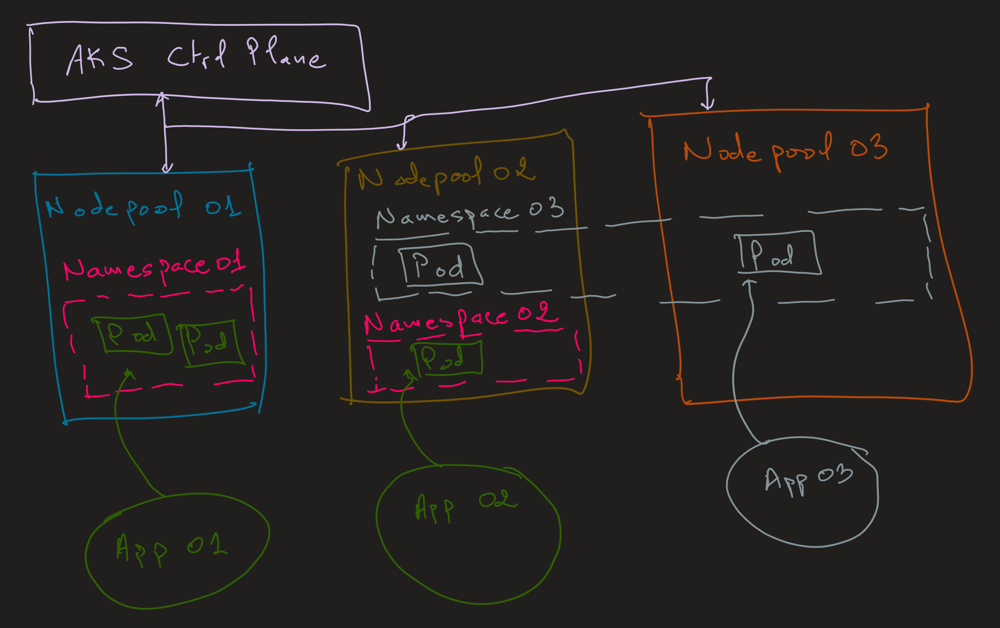

# Scheduling Pods using NodeSelector and Namespace Annotations

## Introduction

How can we enforce all pods within a namespace to be deployed into specific nodes or nodepools ?



Kubernetes supports logical and physical isolation for pods. This includes using namespaces, taints, nodeselectors, node affinity and antiaffinity, etc.
Some customers requires strict physical isolation to meet security requirements or to isolate large applications. 
They require creating a dedicated nodepool for an application. 
The application should be deployed into that specific nodepool.

How to achieve that ?

They have two options:
1. using `NodeSelector` in each deployment targeting that nodepool.
2. using the anotation `scheduler.alpha.kubernetes.io/node-selector` in a namespace.

In this lab we will explore the second option.
https://kubernetes.io/docs/reference/labels-annotations-taints/#schedulerkubernetesnode-selector

## 0. Setup an AKS cluster with 2 user nodepools

```sh
$AKS_RG="rg-aks-cluster"
$AKS_NAME="aks-cluster"

az group create -n $AKS_RG -l westeurope

az aks create -g $AKS_RG -n $AKS_NAME `
              --kubernetes-version "1.25.5" `
              --node-count 3 `
              --network-plugin azure

az aks get-credentials -n $AKS_NAME -g $AKS_RG --overwrite-existing
```

Add 2 user nodepools to the cluster

```sh
az aks nodepool add --name nodepool01 `
       --resource-group $AKS_RG `
       --cluster-name $AKS_NAME `
       --node-count 3 `
       --zones 1 2 3 `
       --mode User

az aks nodepool add --name nodepool02 `
       --resource-group $AKS_RG `
       --cluster-name $AKS_NAME `
       --node-count 3 `
       --zones 1 2 3 `
       --mode User

az aks nodepool list -g $AKS_RG --cluster-name $AKS_NAME -o table
# The behavior of this command has been altered by the following extension: aks-preview
# Name        OsType    VmSize           Count    MaxPods    ProvisioningState    Mode
# ----------  --------  ---------------  -------  ---------  -------------------  ------
# nodepool01  Linux     Standard_DS2_v2  3        30         Succeeded            User
# nodepool02  Linux     Standard_DS2_v2  3        30         Succeeded            User
# nodepool1   Linux     Standard_DS2_v2  3        30         Succeeded            System
```

## 2. Get labels for nodes

```sh
kubectl get nodes --show-labels
Set-Alias -Name grep -Value select-string # only on powershell
kubectl get nodes -o json | jq '.items[].metadata.labels' | grep agentpool
#   "agentpool": "poolapps01",
#   "kubernetes.azure.com/agentpool": "poolapps01",
#   "agentpool": "poolapps02",
#   "kubernetes.azure.com/agentpool": "poolapps02",
#   "agentpool": "poolsystem",
#   "kubernetes.azure.com/agentpool": "poolsystem",
#   "agentpool": "poolsystem",
#   "kubernetes.azure.com/agentpool": "poolsystem",
```

## 3. Create namespace with annotations

```sh
kubectl create namespace ns01
# namespace/ns01 created
kubectl annotate namespace ns01 "scheduler.alpha.kubernetes.io/node-selector=agentpool=nodepool01"
# namespace/ns01 annotated
kubectl describe namespace ns01
# Name:         ns01
# Labels:       kubernetes.io/metadata.name=ns01
# Annotations:  scheduler.alpha.kubernetes.io/node-selector: agentpool=poolapps01
# Status:       Active

# No resource quota.
# No LimitRange resource.
```

## 4. Deploy sample application

```sh
kubectl create deployment nginx01 --image=nginx --replicas=5 -n ns01
# deployment.apps/nginx01 created

kubectl get pods -n ns01 -o wide
# NAME                      READY   STATUS    RESTARTS   AGE   IP             NODE                              
# nginx01-8b5fdc7f8-nfhbp   1/1     Running   0          19s   10.224.0.135   aks-nodepool01-31289001-vmss000002
# nginx01-8b5fdc7f8-swzpb   1/1     Running   0          19s   10.224.0.100   aks-nodepool01-31289001-vmss000000
# nginx01-8b5fdc7f8-t7bmd   1/1     Running   0          20s   10.224.0.99    aks-nodepool01-31289001-vmss000000
# nginx01-8b5fdc7f8-wp87l   1/1     Running   0          19s   10.224.0.124   aks-nodepool01-31289001-vmss000002
# nginx01-8b5fdc7f8-zbxrv   1/1     Running   0          19s   10.224.0.156   aks-nodepool01-31289001-vmss000001
```

Note how the annotation was added into all pods deployed into the namespace

```sh
$POD_NAME=$(kubectl get pods -n ns01 -o jsonpath='{.items[0].metadata.name}')
$POD_NAME
# nginx01-8b5fdc7f8-nfhbp

kubectl describe pod $POD_NAME -n ns01
# Node-Selectors:              agentpool=nodepool01
```

## 5. Create another namespace with annotations

```sh
kubectl create namespace ns02
# namespace/ns02 created

kubectl annotate namespace ns02 "scheduler.alpha.kubernetes.io/node-selector=agentpool=nodepool02"
# namespace/ns02 annotated
kubectl describe namespace ns02
# Name:         ns02
# Labels:       kubernetes.io/metadata.name=ns02
# Annotations:  scheduler.alpha.kubernetes.io/node-selector: agentpool=nodepool02
# Status:       Active

# No resource quota.
# No LimitRange resource.
```

## 6. Deploy a sample app targeting a namespace and a nodepool

```sh
kubectl create deployment nginx02 --image=nginx --replicas=5 -n ns02
# deployment.apps/nginx02 created

kubectl get pods -n ns02 -o wide
# NAME                      READY   STATUS    RESTARTS   AGE   IP             NODE                              
# nginx02-8b5fdc7f8-774bd   1/1     Running   0          12s   10.224.0.250   aks-nodepool02-26503577-vmss000000
# nginx02-8b5fdc7f8-dgjsz   1/1     Running   0          12s   10.224.0.217   aks-nodepool02-26503577-vmss000002
# nginx02-8b5fdc7f8-g78pv   1/1     Running   0          12s   10.224.0.249   aks-nodepool02-26503577-vmss000000
# nginx02-8b5fdc7f8-lcwcw   1/1     Running   0          12s   10.224.0.184   aks-nodepool02-26503577-vmss000001
# nginx02-8b5fdc7f8-s7twk   1/1     Running   0          12s   10.224.0.224   aks-nodepool02-26503577-vmss000002
```

## Additional notes

Some customers, to meet security requirements, creates a dedicated Subnet for each Nodepool and use Azure NSG to limit traffic between different ndepools.

The annotation `scheduler.alpha.kubernetes.io/node-selector` is, per today, in alpha. It might change in the future.

It is technically possible to label specific nodes and use that label to schedule pods. 
This is not a good practice because nodes could be replaced or recreated when cluster upgrades and labels will be lost.
Instead, create a dedicated nodepool with label so that the label will be 'inherited' automatically by all nodes from the nodepool.
