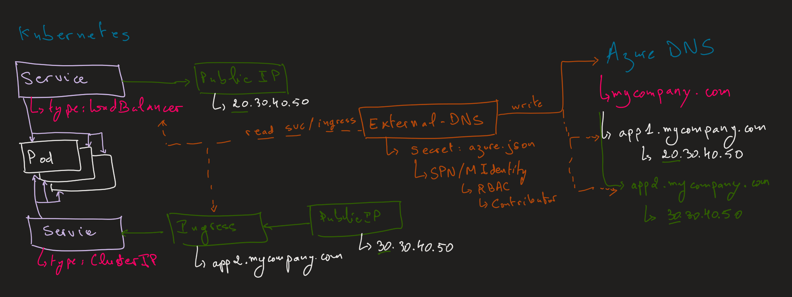
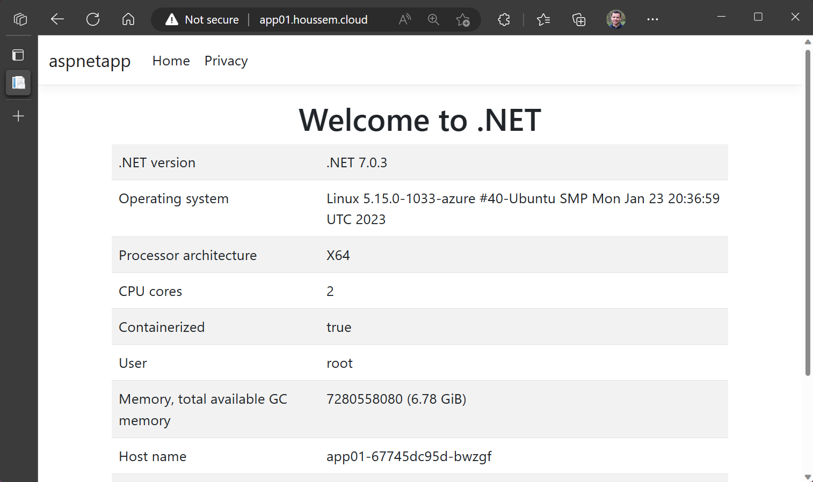
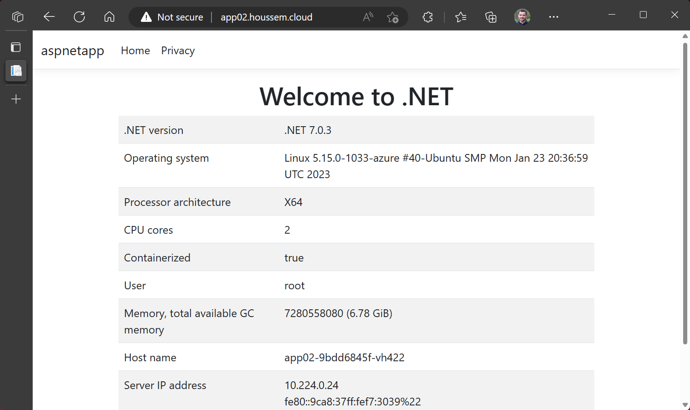
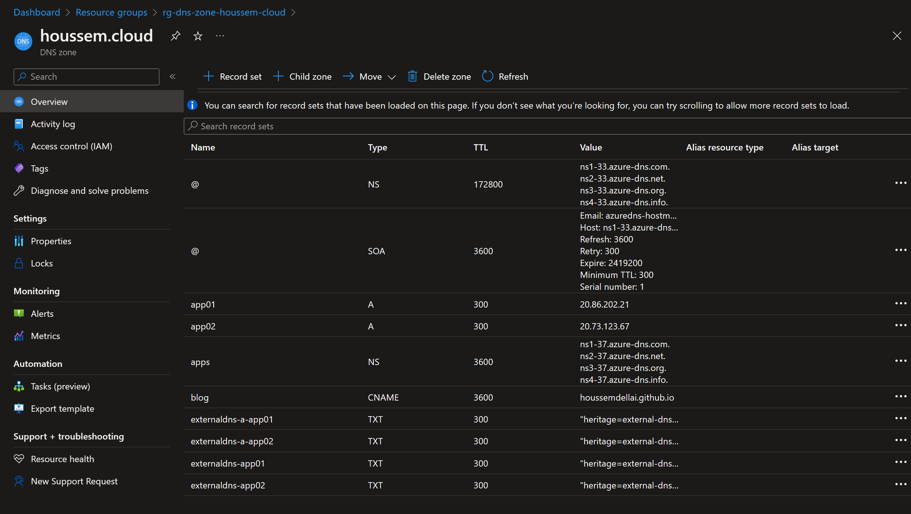

# Kubernetes External DNS for Azure DNS & AKS

## Introduction

After deplying an aplication and its services into a Kubernetes cluster, a question rises on the surface, how to access it with a custom domain name ? A simple solution would be to create an A record that points the domain name into the service IP address. This could be done manually, so it will be too hard to scale as you add many services. And this could be fully automated by using External DNS!
This tutorial describes how to manage custom domain names in Azure DNS using ExternalDNS in AKS.

External DNS is a Kubernetes controller that watches for new Ingresses and Services with specific annotations, then creates corresponding DNS records in Azure DNS.
DNS records in Azure DNS. It is available as an opensource project in Github: 
https://github.com/kubernetes-sigs/external-dns. It supports more than 30 DNS providers including Azure DNS and Private DNS Zone.

External DNS pods authenticates to Azure DNS using one of three methods:
1. Service principal.
2. Kubelet Managed Identity.
3. User assigned Managed Identity controlled by AAD Pod Identity.

Note: Pod Identity is deprecated and will be replaced by Workload Identity.
However, ExternalDNS dos not support yet Workload Identity.
In this tutorial, you will use Service Principal.

Note: If you want to use Kubelet Managed Identity, giving it the Contributor role on the DNS zone is not secure by default. 
That is because any pod in the cluster can access it
To mitigate this issue, you need to implement a Network Policy that restricts access to the IMDS endpoint to only the ExternalDNS pods.

In this tutorial You will work with Service Principal.



## 1. Create an AKS cluster with an ingress controller 

Create AKS cluster

```sh
$AKS_RG="rg-aks-cluster"
$AKS_NAME="aks-cluster"

az group create -n $AKS_RG -l westeurope

az aks create -g $AKS_RG -n $AKS_NAME `
              --kubernetes-version "1.25.5" `
              --node-count 3 `
              --network-plugin azure

az aks get-credentials -n $AKS_NAME -g $AKS_RG --overwrite-existing
```

Install nginx ingress controller

```sh
helm repo add ingress-nginx https://kubernetes.github.io/ingress-nginx

helm repo update

helm upgrade --install ingress-nginx ingress-nginx/ingress-nginx `
     --create-namespace `
     --namespace ingress-nginx `
     --set controller.service.annotations."service\.beta\.kubernetes\.io/azure-load-balancer-health-probe-request-path"=/healthz
```

## 2. Create Azure DNS Zone, or use existing one

You can create a new Azure DNS Zone with or without delegated domain name.
Without delegated domain name means it will not be able to publicly resolve the domain name.
But you will still see the created DNS records.

In this lab, I use a delegated domain name: houssem.cloud.

```sh
$DNS_ZONE_NAME="houssem.cloud"
$DNS_ZONE_RG="rg-azure-dns"

az group create -n $DNS_ZONE_RG -l westeurope

az network dns zone create -g $DNS_ZONE_RG -n $DNS_ZONE_NAME
```

## 3. Create a service principal for ExternalDNS

ExternalDNS will connect to Azure DNS to change its configuration. So, it needs to be authenticated. As mentioned before, You will be using a Service Principal.

```sh
$EXTERNALDNS_SPN_NAME="spn-external-dns-aks"

# Create the service principal
$DNS_SPN=$(az ad sp create-for-rbac --name $EXTERNALDNS_SPN_NAME)
$EXTERNALDNS_SPN_APP_ID=$(echo $DNS_SPN | jq -r '.appId')
$EXTERNALDNS_SPN_PASSWORD=$(echo $DNS_SPN | jq -r '.password')
```

## 4. Assign the RBAC for the service principal

Grant access to Azure DNS zone for the service principal.

```sh
# fetch DNS id and RG used to grant access to the service principal
$DNS_ZONE_ID=$(az network dns zone show -n $DNS_ZONE_NAME -g $DNS_ZONE_RG --query "id" -o tsv)
$DNS_ZONE_RG_ID=$(az group show -g $DNS_ZONE_RG --query "id" -o tsv)

# assign reader to the resource group
az role assignment create --role "Reader" --assignee $EXTERNALDNS_SPN_APP_ID --scope $DNS_ZONE_RG_ID

# assign contributor to DNS Zone itself
az role assignment create --role "DNS Zone Contributor" --assignee $EXTERNALDNS_SPN_APP_ID --scope $DNS_ZONE_ID
```

Verify role assignments

```sh
az role assignment list --all --assignee $EXTERNALDNS_SPN_APP_ID -o table
# Principal                             Role                  Scope
# ------------------------------------  --------------------  ----------------------------------------------------------------------------------------------------------------------------------
# 9cc6c0d1-99a3-4d86-9df4-a84df55b8232  Reader                /subscriptions/82f6d75e-85f4-434a-ab74-5dddd9fa8910/resourceGroups/rg-azure-dns
# 9cc6c0d1-99a3-4d86-9df4-a84df55b8232  DNS Zone Contributor  /subscriptions/82f6d75e-85f4-434a-ab74-5dddd9fa8910/resourceGroups/rg-azure-dns/providers/Microsoft.Network/dnszones/houssem.cloud
```

## 5. Create a Kubernetes secret for the service principal

ExternalDNS expects to find the Service Principal credentials in a JSON file called azure.json saved as a Kubernetes secret. Let's create the file.

```sh
@"
{
  "tenantId": "$(az account show --query tenantId -o tsv)",
  "subscriptionId": "$(az account show --query id -o tsv)",
  "resourceGroup": "$DNS_ZONE_RG",
  "aadClientId": "$EXTERNALDNS_SPN_APP_ID",
  "aadClientSecret": "$EXTERNALDNS_SPN_PASSWORD"
}
"@ > azure.json

cat azure.json
# {
#   "tenantId": "16b3c013-d300-468d-ac64-7eda0820b6d3",
#   "subscriptionId": "82f6d75e-85f4-434a-ab74-5dddd9fa8910",
#   "resourceGroup": "rg-dns-zone-houssem-cloud",
#   "aadClientId": "9cc6c0d1-99a3-4d86-9df4-a84df55b8232",
#   "aadClientSecret": "xxxxxxxx~xxxxxxxxxxxxxxxxxxxxxx"
# }
```

Deploy the credentials as a Kubernetes secret.

```sh
kubectl create namespace external-dns
# namespace/external-dns created

kubectl create secret generic azure-config-file -n external-dns --from-file azure.json
# secret/azure-config-file created
```

Verify secret created

```sh
kubectl describe secret azure-config-file -n external-dns
# Name:         azure-config-file
# Namespace:    external-dns
# Labels:       <none>
# Annotations:  <none>
# 
# Type:  Opaque
# 
# Data
# ====
# azure.json:  552 bytes
```

## 6. Deploy External DNS

ExternalDNS could be deployed through raw YAML manifest, Helm chart or as an operator. For simplicity, You will be using YAML files from this Github repository: https://github.com/HoussemDellai/docker-kubernetes-course/tree/main/61_external_dns.

Before deploying the yaml, change the namespace name in ClusterRoleBinding in external-dns.yaml file

```sh
kubectl apply -f external-dns.yaml -n external-dns
# serviceaccount/external-dns created
# clusterrole.rbac.authorization.k8s.io/external-dns created
# clusterrolebinding.rbac.authorization.k8s.io/external-dns-vieYour created
# deployment.apps/external-dns created
```

Note: To deploy ExternalDNS using Helm charts, checkout these resources:
https://artifacthub.io/packages/helm/bitnami/external-dns 
https://github.com/bitnami/charts/tree/main/bitnami/external-dns/#installing-the-chart
             

Verify deployment

```sh
kubectl get pods,sa -n external-dns
NAME                               READY   STATUS    RESTARTS   AGE
pod/external-dns-5fd5797df-xklxn   1/1     Running   0          96s
NAME                          SECRETS   AGE
serviceaccount/default        0         96m
serviceaccount/external-d
```

## 7. Using ExternalDNS with Kubernetes services

```sh
kubectl apply -f app-lb.yaml 
# deployment.apps/nginx created
# service/nginx-svc created

kubectl get pods,svc
# NAME                            READY   STATUS    RESTARTS   AGE
# pod/app01-67745dc95d-bwzgf      1/1     Running   0          100s

# NAME                 TYPE           CLUSTER-IP    EXTERNAL-IP    PORT(S)        AGE
# service/app01-svc    LoadBalancer   10.0.95.113   20.86.202.21   80:31067/TCP   100s
# service/kubernetes   ClusterIP      10.0.0.1      <none>         443/TCP        2m30s
```

Check what is happening in the external DNS pod

```sh
kubectl logs external-dns-5fd5797df-xklxn -n external-dns
# time="2023-03-06T09:01:15Z" level=info msg="Updating A record named 'app01' to '20.103.4.205' for Azure DNS zone 'houssem.cloud'."
# time="2023-03-06T09:01:16Z" level=info msg="Updating TXT record named 'externaldns-app01' to '\"heritage=external-dns,external-dns/owner=default,external-dns/resource=service/default/app01-svc\"' for Azure DNS zone 'houssem.cloud'."
# time="2023-03-06T09:01:16Z" level=info msg="Updating TXT record named 'externaldns-a-app01' to '\"heritage=external-dns,external-dns/owner=default,external-dns/resource=service/default/app01-svc\"' for Azure DNS zone 'houssem.cloud'."
```

Check the DNS record is created by external DNS

```sh
az network dns record-set a list -g $DNS_ZONE_RG --zone-name $DNS_ZONE_NAME
# [{
#     "aRecords": [
#       {
#         "ipv4Address": "20.103.57.97"
#       }
#     ],
#     "aaaaRecords": null,
#     "caaRecords": null,
#     "cnameRecord": null,
#     "etag": "99b46f74-8388-44d1-80e9-2aafe1f4802d",
#     "fqdn": "myapp.houssem.cloud.",
#     "id": "/subscriptions/82f6d75e-85f4-434a-ab74-5dddd9fa8910/resourceGroups/rg-dns-zone-houssem-cloud/providers/Microsoft.Network/dnszones/houssem.cloud/A/myapp",
#     "metadata": null,
#     "mxRecords": null,
#     "name": "myapp",
#     "nsRecords": null,
#     "provisioningState": "Succeeded",
#     "ptrRecords": null,
#     "resourceGroup": "rg-dns-zone-houssem-cloud",
#     "soaRecord": null,
#     "srvRecords": null,
#     "targetResource": {
#       "id": null
#     },
#     "ttl": 300,
#     "txtRecords": null,
#     "type": "Microsoft.Network/dnszones/A"
#   }]
```



## 8. Create a sample app exposed through ingress

```sh
kubectl apply -f app-ingress.yaml
# deployment.apps/app02 created
# service/app02-svc created
# ingress.networking.k8s.io/app02-ingress created

kubectl get pods,svc,ingress
# NAME                            READY   STATUS    RESTARTS   AGE
# pod/app02-9bdd6845f-vh422       1/1     Running   0          92s

# NAME                 TYPE           CLUSTER-IP    EXTERNAL-IP    PORT(S)        AGE
# service/app02-svc    ClusterIP      10.0.74.196   <none>         80/TCP         92s
# service/kubernetes   ClusterIP      10.0.0.1      <none>         443/TCP        2m30s

# NAME                                      CLASS   HOSTS                 ADDRESS        PORTS   AGE
# ingress.networking.k8s.io/app02-ingress   nginx   app02.houssem.cloud   20.73.123.67   80      92s
```

Check the DNS record is created by external DNS

```sh
az network dns record-set a list -g $DNS_ZONE_RG --zone-name $DNS_ZONE_NAME
# [
# {
#     "aRecords": [
#       {
#         "ipv4Address": "20.73.123.67"
#       }
#     ],
#     "aaaaRecords": null,
#     "caaRecords": null,
#     "cnameRecord": null,
#     "etag": "f1038e1a-85d3-440e-bd91-fc6f8252e3f1",
#     "fqdn": "app02.houssem.cloud.",
#     "id": "/subscriptions/82f6d75e-85f4-434a-ab74-5dddd9fa8910/resourceGroups/rg-dns-zone-houssem-cloud/providers/Microsoft.Network/dnszones/houssem.cloud/A/app02",
#     "metadata": null,
#     "mxRecords": null,
#     "name": "app02",
#     "nsRecords": null,
#     "provisioningState": "Succeeded",
#     "ptrRecords": null,
#     "resourceGroup": "rg-dns-zone-houssem-cloud",
#     "soaRecord": null,
#     "srvRecords": null,
#     "targetResource": {
#       "id": null
#     },
#     "ttl": 300,
#     "txtRecords": null,
#     "type": "Microsoft.Network/dnszones/A"
#   }
# ]
```

Lets check the app and DNS resolution



Let us check the Azure DNS zone configuration.
Note the A records was added with public IP for service and ingress controller.



## Conclusion

Src: https://github.com/kubernetes-sigs/external-dns/blob/master/docs/tutorials/azure.md
