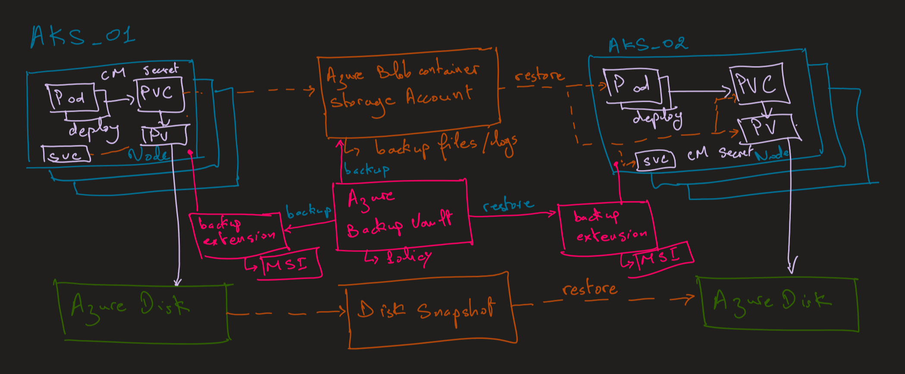

# Creating AKS Backup for Kubernetes objects and Azure Disk



## Introduction


## 0. Prerequisites

```sh
az provider register --namespace Microsoft.KubernetesConfiguration
az feature register --namespace "Microsoft.ContainerService" --name "TrustedAccessPreview"
```

## 1. Setup environment variables

```sh
$AKS_NAME_01="aks-cluster-01"
$AKS_RG_01="rg-aks-cluster-01"

$AKS_NAME_02="aks-cluster-02"
$AKS_RG_01_02="rg-aks-cluster-02"

$VAULT_NAME="backup-vault"
$VAULT_RG="rg-backup-vault"

$SA_NAME="storage4aks1backup135"
$SA_RG="rg-backup-storage"
$BLOB_CONTAINER_NAME="aks-backup"
$SUBSCRIPTION_ID=$(az account list --query [?isDefault].id -o tsv)
```

## 2. Create Backup Vault resource group and Backup Vault

```sh
az group create --name $VAULT_RG --location westeurope

az dataprotection backup-vault create `
   --vault-name $VAULT_NAME `
   -g $VAULT_RG `
   --storage-setting "[{type:'LocallyRedundant',datastore-type:'VaultStore'}]"
```

## 3. Create storage acount and Blob container for storing Backup data

```sh
az group create --name $SA_RG --location westeurope

az storage account create `
   --name $SA_NAME `
   --resource-group $SA_RG `
   --sku Standard_LRS

$ACCOUNT_KEY=$(az storage account keys list --account-name $SA_NAME -g $SA_RG --query "[0].value" -o tsv)

az storage container create `
   --name $BLOB_CONTAINER_NAME `
   --account-name $SA_NAME `
   --account-key $ACCOUNT_KEY
```

## 4. Create first AKS cluster with CSI Disk Driver and Snapshot Controller

```sh
az group create --name $AKS_RG_01 --location westeurope

az aks create -g $AKS_RG_01 -n $AKS_NAME_01 -k "1.25.5" --zones 1 2 3

# Verify that CSI Disk Driver and Snapshot Controller are installed

az aks show -g $AKS_RG_01 -n $AKS_NAME_01 --query storageProfile
# {
#   "blobCsiDriver": null,
#   "diskCsiDriver": {
#     "enabled": true,
#     "version": "v1"
#   },
#   "fileCsiDriver": {
#     "enabled": true
#   },
#   "snapshotController": {
#     "enabled": true
#   }
# }
If not installed, you ca install it with this command:
az aks update -g $AKS_RG_01 -n $AKS_NAME_01 --enable-disk-driver --enable-snapshot-controller
```

## 5. Create second AKS cluster with CSI Disk Driver and Snapshot Controller

```sh
az group create --name $AKS_RG_02 --location westeurope

az aks create -g $AKS_RG_02 -n $AKS_NAME_02 -k "1.25.5" --zones 1 2 3

# Verify that CSI Disk Driver and Snapshot Controller are installed

az aks show -g $AKS_RG_02 -n $AKS_NAME_02 --query storageProfile
```

## Conclusion
